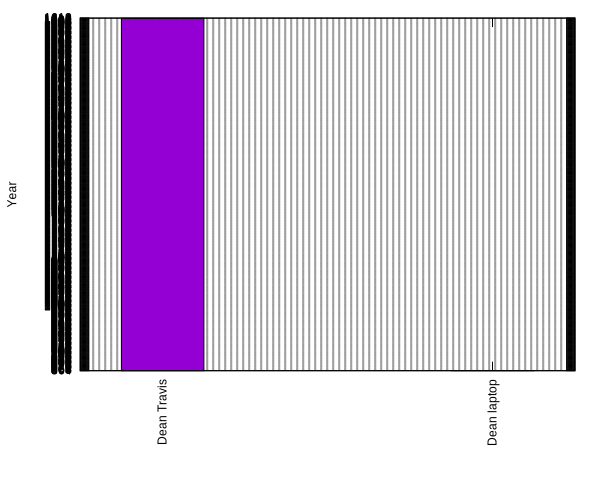

[](https://travis-ci.org/deanturpin/swob)
[](https://codecov.io/gh/deanturpin/swob)

A measure of software obsolescence based on toolchain age. Edit
```projects.txt``` and ```tools.txt``` then run ```make clean all``` to generate
a new readme. The roadmaps are guides for where you might hope to be if you kept your whole toolchain up-to-date.

---
Fri 20 Jul 08:56:29 BST 2018
# Tools
```
gcc
4.1.2 2007 4.8.3 2014 4.8.5 2015 5 2016 6 2017 7 2018 8 2018

clang
3.5 2014 4 2017 5 2017 6 2018

C++
98 1998 03 2003 0x 2008 11 2011 14 2014 17 2017 2a 2020

Ubuntu
12 2012 13 2013 14 2014 15 2015 16 2016 17 2017 18 2018 19 2019

kernel
3.10 2013 4.10 2017 4.14 2018 4.17 2018 3.10.0-327 2013 2.6.32-642 2009 2.6.18-128 2006 3.19.8 2014

Python
3.5.3 2017 3.6.5 2018

Qt
4.8.7 2011 5.6 2016 5.9 2017 5.12 2018

fw
4.1-rc8 2018 4.1.0-rc7.r17164 3.14.2 2010 4.0.0 2016 5.0.0-rc6 2018

Windows
XP 2001 7 2008 10 2010 XP_Pro 2005

Red Hat Linux
5 2007 6 2010 6.5 2013 7 2014 8 2019

Ada
95 1995 2005 2007 2012 2012

Visual Studio
6.0 1998 7.0 2002 2005 2005 2010 2010 2015 2015

Oracle
10g 2005 12c 2016

```
# Projects
```
Dean laptop
kali 2018.2 gcc 8 clang 6 C++ 14 kernel 4.15 python 3.5.3 Firefox 53.7.3 bash 4.4

Dean Travis
Ubuntu 14 gcc 6 kernel 4.14 clang 6 C++ 14

Roadmap 2018
Ubuntu 18 gcc 7 clang 5 C++ 14 kernel 4.14 python 3.5.3 Ada 2012 Windows 2010 qt 5.6 RHEL 7 fw 5.0.0 rc6

Roadmap 2019
Ubuntu 19 gcc 8 clang 6 C++ 17 kernel 4.17 python 3.6.5 Ada 2012 Windows 2010 qt 5.12 RHEL 8 fw 5.0.0 rc6

Example project 1
gcc 4.8.5 C++ 03 kernel 3.10 Windows 10 qt 4.8.7 RHEL 7 fw 4.1 rc8

Example project 2
gcc 4.1.2 C++ 98 kernel 3.10 RHEL 5 fw 3.14.2

```
4.1.2	2007
4.8.3	2014
4.8.5	2015
5	2016
6	2017
7	2018
8	2018
3.5	2014
4	2017
5	2017
6	2018
98	1998
03	2003
0x	2008
11	2011
14	2014
17	2017
2a	2020
12	2012
13	2013
14	2014
15	2015
16	2016
17	2017
18	2018
19	2019
3.10	2013
4.10	2017
4.14	2018
4.17	2018
3.10.0-327	2013
2.6.32-642	2009
2.6.18-128	2006
3.19.8	2014
3.5.3	2017
3.6.5	2018
4.8.7	2011
5.6	2016
5.9	2017
5.12	2018
4.1-rc8	2018
4.1.0-rc7.r17164	3.14.2
2010	4.0.0
2016	5.0.0-rc6
XP	2001
7	2008
10	2010
XP_Pro	2005
5	2007
6	2010
6.5	2013
7	2014
8	2019
95	1995
2005	2007
2012	2012
6.0	1998
7.0	2002
2005	2005
2010	2010
2015	2015
10g	2005
12c	2016
13 tools
kali	2018.2
gcc	8
clang	6
C++	14
kernel	4.15
python	3.5.3
Firefox	53.7.3
bash	4.4
Ubuntu	14
gcc	6
kernel	4.14
clang	6
C++	14
Ubuntu	18
gcc	7
clang	5
C++	14
kernel	4.14
python	3.5.3
Ada	2012
Windows	2010
qt	5.6
RHEL	7
fw	5.0.0
Ubuntu	19
gcc	8
clang	6
C++	17
kernel	4.17
python	3.6.5
Ada	2012
Windows	2010
qt	5.12
RHEL	8
fw	5.0.0
gcc	4.8.5
C++	03
kernel	3.10
Windows	10
qt	4.8.7
RHEL	7
fw	4.1
gcc	4.1.2
C++	98
kernel	3.10
RHEL	5
fw	3.14.2
6 projects
Dean laptop
	kali	2018.2	0
	gcc	8	2018
	clang	6	2018
	C++	14	2014
	kernel	4.15	-1
	python	3.5.3	0
	Firefox	53.7.3	0
	bash	4.4	0
	Average age of "Dean laptop" 756.125
Dean Travis
	Ubuntu	14	2014
	gcc	6	2017
	kernel	4.14	2018
	clang	6	2018
	C++	14	2014
	Average age of "Dean Travis" 2016.2
Roadmap 2018
	Ubuntu	18	2018
	gcc	7	2018
	clang	5	2017
	C++	14	2014
	kernel	4.14	2018
	python	3.5.3	0
	Ada	2012	2012
	Windows	2010	-1
	qt	5.6	0
	RHEL	7	0
	fw	5.0.0	-1
	Average age of "Roadmap 2018" 1099.55
Roadmap 2019
	Ubuntu	19	2019
	gcc	8	2018
	clang	6	2018
	C++	17	2017
	kernel	4.17	2018
	python	3.6.5	0
	Ada	2012	2012
	Windows	2010	-1
	qt	5.12	0
	RHEL	8	0
	fw	5.0.0	-1
	Average age of "Roadmap 2019" 1100
Example project 1
	gcc	4.8.5	2015
	C++	03	2003
	kernel	3.10	2013
	Windows	10	2010
	qt	4.8.7	0
	RHEL	7	0
	fw	4.1	-1
	Average age of "Example project 1" 1148.57
Example project 2
	gcc	4.1.2	2007
	C++	98	1998
	kernel	3.10	2013
	RHEL	5	0
	fw	3.14.2	-1
	Average age of "Example project 2" 1203.4

