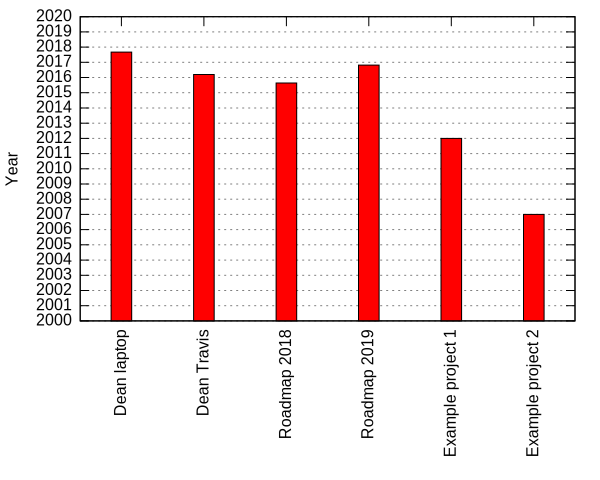

[](https://travis-ci.org/deanturpin/swob)
[](https://codecov.io/gh/deanturpin/swob)

A measure of software obsolescence based on toolchain age. Edit
```projects.txt``` and ```tools.txt``` then run ```make clean all``` to generate
a new readme. The roadmaps are guides for where you might hope to be if you kept your whole toolchain up-to-date.

---
Mon 23 Jul 17:39:32 BST 2018

# Tools
```
gcc
4.1.2 2007 4.8.3 2014 4.8.5 2015 5 2016 6 2017 7 2018 8 2018

clang
3.5 2014 4 2017 5 2017 6 2018

c++
98 1998 03 2003 0x 2008 11 2011 14 2014 17 2017 2a 2020

ubuntu
12 2012 13 2013 14 2014 15 2015 16 2016 17 2017 18 2018 19 2019

kali
2018.2 2018

kernel
3.10 2013 4.10 2017 4.14 2018 4.16 2018 3.10.0-327 2013 2.6.32-642 2009 2.6.18-128 2006 3.19.8 2014 4.17 2018

python
3.5.3 2017 3.6.5 2018

qt
4.8.7 2011 5.6 2016 5.9 2017 5.12 2018

fw
5.0.0-rc6 2018 4.1-rc8 2018 3.14.2 2010 4.0.0 2016

windows
XP 2001 7 2008 10 2010 XP_Pro 2005

rhel
5 2007 6 2010 6.5 2013 7 2014 8 2019

ada
95 1995 2005 2007 2012 2012

vs
6.0 1998 7.0 2002 2005 2005 2010 2010 2015 2015

oracle
10g 2005 12c 2016

```
# Projects
```
Dean laptop
kali 2018.2 gcc 8 clang 6 c++ 17 kernel 4.16 python 3.5.3

Dean Travis
ubuntu 14 gcc 6 kernel 4.14 clang 6 c++ 14

Roadmap 2018
ubuntu 18 gcc 7 clang 5 c++ 14 kernel 4.14 python 3.5.3 ada 2012 windows 10 qt 5.6 rhel 7 fw 5.0.0-rc6

Roadmap 2019
ubuntu 19 gcc 8 clang 6 c++ 17 kernel 4.17 python 3.6.5 ada 2012 windows 10 qt 5.12 rhel 8 fw 5.0.0-rc6

Example project 1
gcc 4.8.5 c++ 03 kernel 3.10 windows 10 qt 4.8.7 rhel 7 fw 4.1-rc8

Example project 2
gcc 4.1.2 c++ 98 kernel 3.10 rhel 5 fw 3.14.2

```
